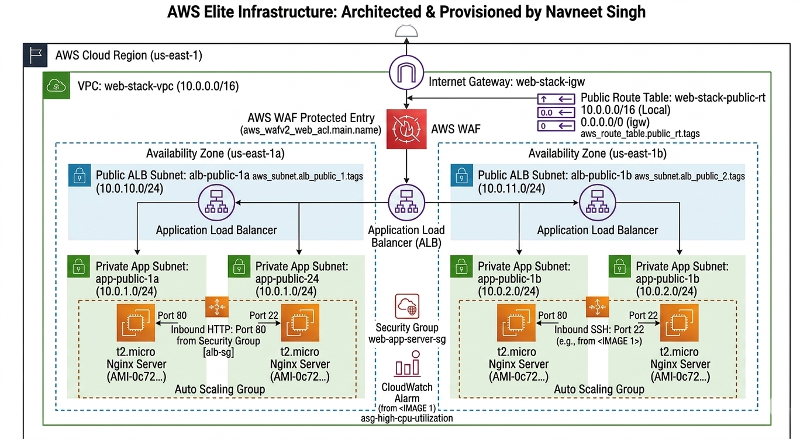

# AWS Secure-Stack: Modular Multi-AZ Infrastructure

A production-grade cloud environment provisioned using a modular Terraform framework. This project focuses on high-availability networking, tiered security isolation, and automated workload scaling on AWS.

## Architecture

*Figure 1: Full-stack architecture detailing multi-AZ configuration and security group chaining via ALB and WAF.*

## Key Architectural Features

* **Modular Framework:** Infrastructure logic is decoupled into reusable modules, ensuring scalability and maintainability across different deployment environments.
* **Multi-AZ Resiliency:** Workloads are distributed across `us-east-1a` and `us-east-1b` using an Auto Scaling Group (ASG) to mitigate regional data center failures.
* **Security Group Chaining:** Implements a Zero-Trust model where the application tier is isolated. The servers strictly accept ingress traffic only from the Application Load Balancer's Security Group ID.
* **Edge Defense:** Integration of **AWS WAF (Web Application Firewall)** with managed rule sets to protect against common web exploits and DDoS vectors.
* **Automated Provisioning:** Nginx deployment is handled via Cloud-Init/User-Data with custom logic to resolve apt-lock issues during high-velocity boots.

## Tech Stack
* **Cloud:** AWS (VPC, ALB, ASG, WAF, CloudWatch)
* **IaC:** Terraform (Modular Structure)
* **Security:** Security Group Chaining, WAF ACLs
* **Web Layer:** Ubuntu 22.04 LTS + Nginx

## Project Structure
```text
/proj3
├── main.tf              # Root Orchestrator
├── outputs.tf           # Final Deployment Links
├── /docs                # Architecture & Implementation Proofs
└── /modules
    └── /web_stack       # Core Infrastructure Logic
        ├── main.tf      # Resource Definitions
        ├── variables.tf # Input Parameters
        └── outputs.tf   # Resource Export Logic