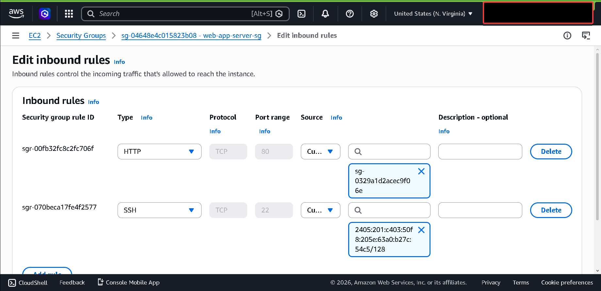
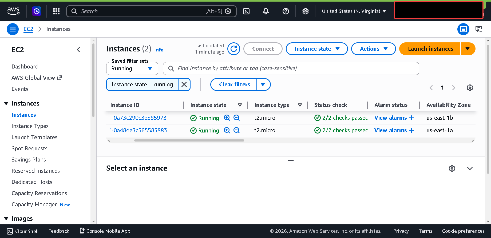
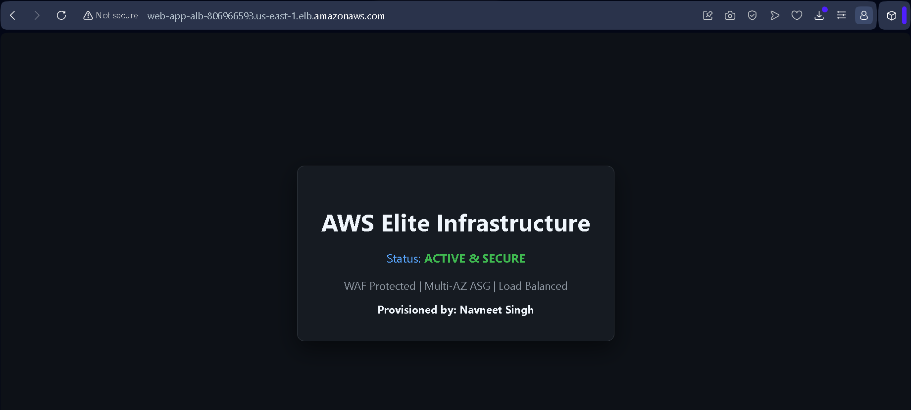
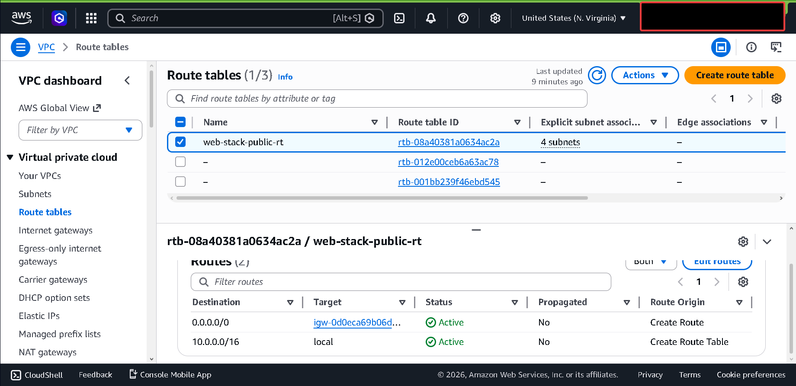

# AWS Secure-Stack: Modular Multi-AZ Infrastructure

A production-grade cloud environment provisioned using a modular Terraform framework. This architecture is designed for high-availability (HA) and implements a Zero-Trust security model at the network layer.


* **Regional Failover:** Resources are distributed across `us-east-1a` and `us-east-1b`. This ensures 99.99% availability; if one AWS data center experiences an outage, the Auto Scaling Group (ASG) maintains service continuity.
* **Modular Decoupling:** Infrastructure logic is isolated in `/modules/web_stack`. This allows the core engine to be reused across different environments (Dev/Staging/Prod) while the root module handles environment-specific variables like CIDR blocks and IP filtering.

---


### 1. Ingress Filtering & Security Group Chaining
To mitigate direct attack vectors, I implemented a tiered security model.
* **Edge Tier (ALB-SG):** Public-facing; strictly filtered for Port 80 ingress.
* **Application Tier (App-SG):** Isolated; strictly accepts traffic **ONLY** from the ALB-SG.
* **Dynamic SSH Hardening:** Port 22 is dynamically restricted to the current Admin IP using a Terraform `http` data source, eliminating the risk of wide-open SSH ports.

**Verification of Restricted Ingress:**


### 2. Edge Defense (AWS WAF)
The Application Load Balancer is protected by a Web Application Firewall. I integrated **AWS Managed Rules (CommonRuleSet)** to inspect and drop malicious traffic (SQLi, XSS, and bot scrapers) before it reaches the compute layer.

---


### High Availability Instance Fleet
Verification of the Auto Scaling Group successfully provisioning identical t2.micro nodes across multiple Availability Zones.


### Final Visual State (Custom Nginx Dashboard)
The `user_data` script automates the full stack: Nginx installation, system lock handling, and deployment of a custom-branded landing page.


### VPC Routing & Egress Logic
Confirmation of the VPC routing table correctly mapping the `0.0.0.0/0` route to the **Internet Gateway (IGW)** for public egress.


---

```text
/proj3
├── main.tf              # Root Orchestrator (calls modules & data sources)
├── outputs.tf           # Final Endpoint URL exports
├── .gitignore           # Prevents state/plugin leakage to GitHub
├── /docs                # Architecture & Evidence Assets
└── /modules
    └── /web_stack       # Reusable Infrastructure Engine
        ├── main.tf      # AWS Resource definitions
        ├── variables.tf # Module Input ports
        └── outputs.tf   # Module Export ports